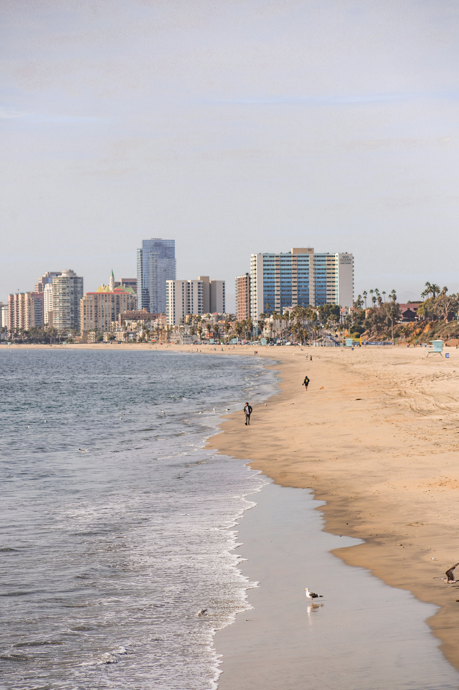
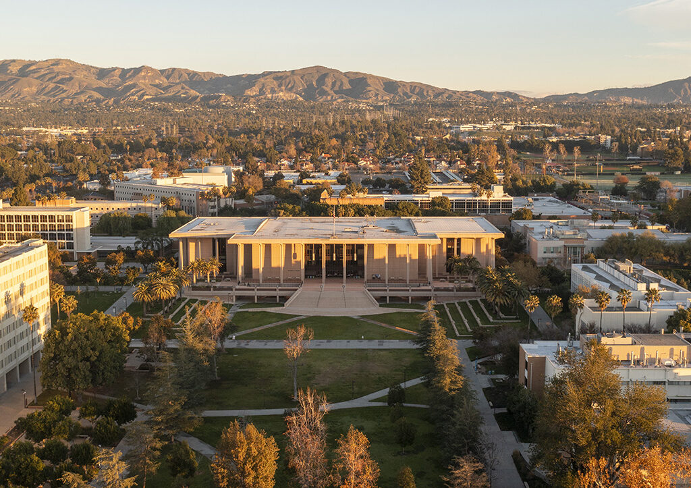

# me-in-markdown
Hi my name is Oscar Contreras and I am currently in 9th grader freshman in Chatsworth Charter High School. Recent new skills I am currently trying to learn to cook, learn coding, and sowing so far. My Favorite things to do is to play pool, basketball, and video games. I have a dog that is named Frijol. Places I would want to visit in the future is to go to Mexico Jerez since I miss going there and we used to go there every summer. My goals is to get the career I want to get in the future which is being an Architect, second goal is to get to college in the future , and at last another goal I want to achive is being more healthy in the future so I can be more in shape. This summer I went to long Beach and stayed at a hotel that had many restaurants built in and had 2 pools. 

My favorite memory with friends in the summer was when I went to camping with friends and stayed for about only 2 days since I get to hangout and get to do fishing for the first time. A personal achievement I made was when I learned how to play the trumpet after 3 years of playing in band. Another personal achievement I made was when I learned how to bake because I have started to learn how to make cookies and later on I can make even more achievements that I can learn. My favorite movies are the Backrooms, Obsession, and Nacho Libre. My favorite foods are tortas, burritos, fish tacos, pasta, pizza, burgers, and much more.

Games that I play is Unseen Liminality, Read Dead Redemtion 1 & 2, Cuphead, Ghost of Tsushima, Minecraft, Mario games, Zelda games, and Sonic games. 

### ***The college I want to go to in the future***

**Spotify Playlist**

### [[Click me to hear playlist]](https://open.spotify.com/playlist/6ijtRex1JIeASWSSjfEPO1?si=jvLoblteS3CcNg_maZXYSQ&utm_source=copy-link&pi=F9lbMr3jTNev1).
